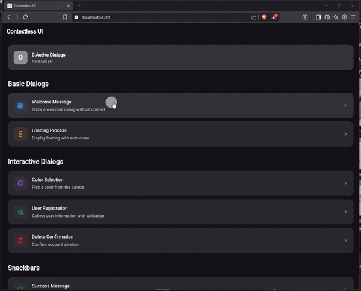

# Contextless UI

[](https://pub.dev/packages/contextless_ui)
[](https://opensource.org/licenses/MIT)

A Flutter package for displaying UI components without requiring
BuildContext. Show dialogs, snackbars, toasts, and bottom sheets from
anywhere in your code.

## Demo

[](https://www.youtube.com/watch?v=2pprA48Dmmc)

## Features

- No BuildContext required - display UI from anywhere (services, controllers, etc.)
- Unified API for dialogs, snackbars, toasts, and bottom sheets
- Manage components by handle, ID, or tag
- Async support with return values
- Custom styling with decoration models
- Built-in transitions and animations
- Event streams for analytics
- Cross-platform support

## Installation

```yaml
dependencies:
  contextless_ui: ^0.1.0
```

## Quick Start

### Initialize

Add `ContextlessObserver` to your MaterialApp:

```dart
import 'package:contextless_ui/contextless_ui.dart';

class MyApp extends StatelessWidget {
  final navigatorKey = GlobalKey<NavigatorState>();

  @override
  Widget build(BuildContext context) {
    return MaterialApp(
      navigatorKey: navigatorKey,
      navigatorObservers: [ContextlessObserver()],
      home: const MyHomePage(),
    );
  }
}
```

### Usage Examples

#### Dialogs

```dart
void showLoadingDialog() {
  final handle = ContextlessDialogs.show(
    const Dialog(
      child: Padding(
        padding: EdgeInsets.all(24),
        child: Column(
          mainAxisSize: MainAxisSize.min,
          children: [
            CircularProgressIndicator(),
            SizedBox(height: 16),
            Text('Loading...'),
          ],
        ),
      ),
    ),
  );
  
  Future.delayed(const Duration(seconds: 3), () {
    ContextlessDialogs.close(handle);
  });
}
```

#### Snackbars

```dart
void showNotification() {
  ContextlessSnackbars.show(
    const Text('File uploaded successfully!'),
    action: TextButton(
      onPressed: () => openFile(),
      child: const Text('View'),
    ),
    decoration: const SnackbarDecoration(
      backgroundColor: Colors.green,
    ),
  );
}
```

#### Toasts

```dart
void showToast() {
  ContextlessToasts.show(
    const Text('Operation completed'),
    iconLeft: const Icon(Icons.check_circle, color: Colors.white),
    decoration: const ToastDecoration(
      backgroundColor: Colors.black87,
      borderRadius: BorderRadius.all(Radius.circular(8)),
    ),
  );
}
```

#### Bottom Sheets

```dart
void showSettings() {
  ContextlessBottomSheets.show(
    Container(
      padding: const EdgeInsets.all(16),
      child: const Text('Settings'),
    ),
    decoration: const BottomSheetDecoration(
      shape: RoundedRectangleBorder(
        borderRadius: BorderRadius.vertical(top: Radius.circular(16)),
      ),
    ),
  );
}
```

#### Async Results

```dart
Future<String?> pickColor() async {
  return await ContextlessDialogs.showAsync<String>(
    Dialog(
      child: Column(
        mainAxisSize: MainAxisSize.min,
        children: [
          ElevatedButton(
            onPressed: () => ContextlessDialogs.closeAll('red'),
            child: const Text('Red'),
          ),
          ElevatedButton(
            onPressed: () => ContextlessDialogs.closeAll('blue'),
            child: const Text('Blue'),
          ),
        ],
      ),
    ),
  );
}
```

## API Reference

### Dialog API

```dart
// Show a dialog
DialogHandle show(
  Widget dialog, {
  String? id,
  String? tag,
  bool barrierDismissible = true,
  DialogDecoration? decoration,
});

// Async dialog with return value
Future<T?> showAsync<T>(Widget dialog, {...});

// Close methods
ContextlessDialogs.close(handle);
ContextlessDialogs.closeById(id);
ContextlessDialogs.closeByTag(tag);
ContextlessDialogs.closeAll();
```

### Snackbar API

```dart
// Show a snackbar
SnackbarHandle show(
  Widget content, {
  Widget? action,
  Widget? iconLeft,
  Widget? iconRight,
  String? id,
  String? tag,
  Duration duration,
  SnackbarDecoration? decoration,
});

// Decoration model
SnackbarDecoration({
  Color? backgroundColor,
  EdgeInsetsGeometry? margin,
  EdgeInsetsGeometry? padding,
  double? elevation,
  ShapeBorder? shape,
  SnackBarBehavior behavior,
  // ... more properties
});
```

### Toast API

```dart
// Show a toast
ToastHandle show(
  Widget content, {
  Widget? iconLeft,
  Widget? iconRight,
  String? id,
  String? tag,
  Duration duration,
  Alignment alignment,
  ToastDecoration? decoration,
});

// Decoration model
ToastDecoration({
  Color? backgroundColor,
  EdgeInsetsGeometry? padding,
  BorderRadius? borderRadius,
  double? elevation,
});
```

### Bottom Sheet API

```dart
// Show a bottom sheet
BottomSheetHandle show(
  Widget content, {
  String? id,
  String? tag,
  bool isDismissible,
  bool enableDrag,
  BottomSheetDecoration? decoration,
});

// Decoration model
BottomSheetDecoration({
  Color? backgroundColor,
  double? elevation,
  ShapeBorder? shape,
  BoxConstraints? constraints,
});
```

## Advanced Features

### Tag-based Management

```dart
// Group components with tags
ContextlessDialogs.show(dialog, tag: 'loading');
ContextlessToasts.show(toast, tag: 'loading');

// Close all components with the same tag
ContextlessDialogs.closeByTag('loading');
```

### Event Streams

```dart
// Listen to events
ContextlessDialogs.events.listen((event) {
  print('Dialog ${event.handle.id} ${event.type}');
});
```

### Custom Transitions

```dart
// Built-in transitions
DialogTransitions.fade
DialogTransitions.slideFromBottom
DialogTransitions.scale

// Use in decoration
ContextlessDialogs.show(
  dialog,
  decoration: DialogDecoration(
    transitionsBuilder: DialogTransitions.fade,
  ),
);
```

### Mixed Component Usage

```dart
void showMixedComponents() {
  // Show multiple component types together
  final snackbar = ContextlessSnackbars.show(
    const Text('Background task running'),
    tag: 'background',
  );
  
  final dialog = ContextlessDialogs.show(
    const ProcessingDialog(),
    tag: 'background',
  );
  
  final toast = ContextlessToasts.show(
    const Text('Starting process...'),
    tag: 'background',
  );
  
  // Close all background components later
  Timer(const Duration(seconds: 5), () {
    ContextlessSnackbars.closeByTag('background');
    ContextlessDialogs.closeByTag('background');
    ContextlessToasts.closeByTag('background');
  });
}
```

## Best Practices

### 1. Initialize Early

Always initialize before `runApp()`:

```dart
void main() {
  WidgetsFlutterBinding.ensureInitialized();
  
  final navigatorKey = GlobalKey<NavigatorState>();
  ContextlessUi.init(navigatorKey: navigatorKey);
  
  runApp(MyApp(navigatorKey: navigatorKey));
}
```

### 2. Use Tags for Organization

Group related components for easier management:

```dart
// Progress components
ContextlessSnackbars.show(const Text('Step 1'), tag: 'wizard');
ContextlessToasts.show(const Text('Step 2'), tag: 'wizard');

// Error components  
ContextlessSnackbars.show(const Text('Error'), tag: 'error');

// Close all wizard components when done
ContextlessSnackbars.closeByTag('wizard');
ContextlessToasts.closeByTag('wizard');
```

### 3. Handle Async Results Properly

```dart
Future<void> showConfirmationDialog() async {
  final confirmed = await ContextlessDialogs.showAsync<bool>(
    const ConfirmationDialog(),
  );
  
  if (confirmed == true) {
    // User confirmed
    await performAction();
  }
  // Handle null (dismissed) vs false (cancelled)
}
```

### 4. Use Consistent Styling Patterns

```dart
// Instead of manually creating styled snackbars
ContextlessSnackbars.show(
  const Text('Success!'),
  decoration: const SnackbarDecoration(
    backgroundColor: Colors.green,
  ),
);

// For common patterns, create helper functions
void showSuccessMessage(String message) {
  ContextlessSnackbars.show(
    Text(message),
    iconLeft: const Icon(Icons.check_circle, color: Colors.white),
    decoration: const SnackbarDecoration(
      backgroundColor: Colors.green,
    ),
  );
}
```

### 5. Listen to Events for Analytics

```dart
void initializeAnalytics() {
  ContextlessUi.events.listen((event) {
    analytics.track('ui_${event.type.name}', {
      'component_type': event.handle.type.name,
      'component_id': event.handle.id,
      'component_tag': event.handle.tag,
      'result': event.result,
    });
  });
}
```

### 6. Cleanup on App Disposal

```dart
class MyApp extends StatefulWidget {
  @override
  State<MyApp> createState() => _MyAppState();
}

class _MyAppState extends State<MyApp> {
  @override
  void dispose() {
    ContextlessUi.dispose();
    ContextlessDialogs.dispose();
    super.dispose();
  }
  
  // ... rest of widget
}
```

## Common Issues & Solutions

### "ContextlessUi not initialized" Error

Make sure you call `init()` before `runApp()` and pass the navigator key:

```dart
// Wrong
runApp(const MyApp());
ContextlessUi.init(navigatorKey: key); // Too late!

// Correct  
ContextlessUi.init(navigatorKey: key);
runApp(MyApp(navigatorKey: key));
```

### Navigator Key Not Working

Ensure the same key is passed to both `init()` and `MaterialApp`:

```dart
final navigatorKey = GlobalKey<NavigatorState>(); // Create once

ContextlessUi.init(navigatorKey: navigatorKey); // Use same key
runApp(MaterialApp(navigatorKey: navigatorKey, ...)); // Use same key
```

### Components Not Appearing

Check that:

1. You've called `init()` with a valid key
2. The widget tree has been built at least once
3. You're not calling from an isolate without proper context

### Memory Leaks

Always dispose the system when your app shuts down:

```dart
@override
void dispose() {
  ContextlessUi.dispose(); // This closes all components and cleans up
  ContextlessDialogs.dispose();
  super.dispose();
}
```

## Component Types

| Component | Use Case | Key Features |
| :-------- | :------- | :----------- |
| Dialog | Modal interactions | Barrier, transitions, blocking |
| Snackbar | Status updates | Material Design, actions, auto-dismiss |
| Toast | Simple notifications | Lightweight, flexible positioning |
| Bottom Sheet | Options, forms | Material Design, drag support |

## Platform Support

- Android - Full support with Material Design
- iOS - Full support with Cupertino styling
- Web - Full support with responsive design
- Desktop - Windows, macOS, Linux support
- Embedded - Flutter embedded platforms

## Examples

Check out the `/example` folder for a complete working example showcasing:

- All component types in action
- Async dialogs with results
- Tag-based component management
- Custom styling and transitions
- Service layer integration
- Builder patterns
- Event stream usage

## License

MIT License - see the [LICENSE](LICENSE) file for details.

## Contributing

Contributions are welcome. Fork the repository, create a feature branch,
add tests, and submit a pull request.
